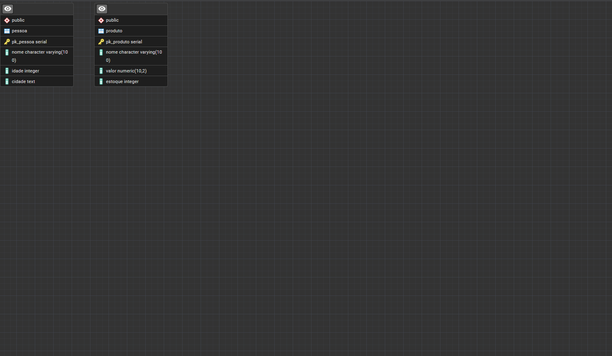

# Sistema de Banco de Dados - Comandos DML

Projeto de Banco de Dados, loja básica, estudo de DML.

## Estrutura

- Pessoa
- Produto

## Tecnologias

PostgreSQL

SQL

## Como executar

Inicie o arquivo Query com seu Banco de Dados.

## Diagrama - Loja, DML

  

